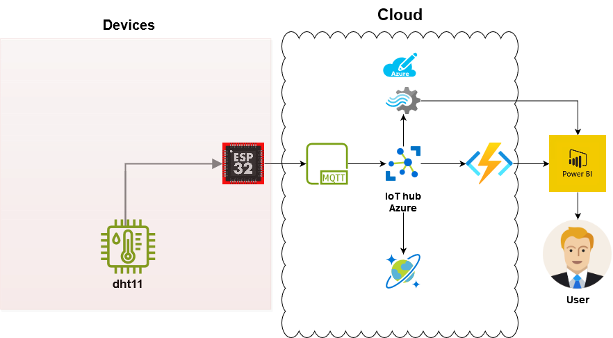

# Konfigurera Azure IoT Hub för ESP32-S och DHT11

## innehållsförteckning
- [Översikt](#översikt)
- [Introduktion](#Introduktion)
-   [Komponenter](#Komponenter) 
-  .
- [Stream Analytics](#testning-och-validering) för att bearbeta och analysera data.
- [PowerBI](#slutsats) för att visualisera data.
- [Cosmos DB](#slutsats) för att lagra data.
  
## översikt

*översikt på Diagramet för IoT flödet setup.*
--- 
## Introduktion
Detta projekt är en omfattande guide för att konfigurera och använda Azure IoT Hub för att samla in och analysera data från en ESP32-S enhet kopplad till en DHT11-sensor. Genom att följa denna guide kommer du att kunna skapa en IoT-lösning som kan samla in, bearbeta och visualisera data i realtid. Detta kan vara särskilt användbart för olika IoT-applikationer, som att övervaka miljöförhållanden, skapa smarta hemlösningar eller för att förbättra affärsprocesser genom att använda datainsikter. Slutresultatet kommer att vara en fullt fungerande IoT-lösning som kan skala upp för att hantera stora mängder data och ge värdefulla insikter genom visualisering i PowerBI.

## Komponenter
- Ett aktivt Azure-konto.
- En IoT-hub på ditt Azure-konto.
- En ESP32-S och DHT11 som är korrekt konfigurerad och ansluten.
- Arduino IDE för att programmera ESP32.
- Stream Analytics för att bearbeta och analysera data.
- PowerBI för att visualisera data.
- Cosmos DB för att lagra data.
  
---
   *Esp32 och DHT11 Setap* 

## Steg-för-steg
steg för steg över hur man ska installera och använda biblioteken i Arduino IDE för projektet.

### Steg 1: 
1. **Installera den senaste versionen av Arduino IDE från Arduino:s officiella webbplats**: Besök [Arduino](https://www.arduino.cc/en/software) och logga in med ditt konto.
2. **Installera ESP8266-paketet i Arduino IDE genom att följa instruktionerna.**:  (http://arduino.esp8266.com/stable/package_esp8266com_index.json). 
3. **Konfigurera IoT Hub**:
   - **Subscription**: Välj din prenumeration.
   - **Resource Group**: Skapa en ny resursgrupp eller välj en befintlig.
   - **Region**: Välj den region som är närmast dig.
   - **IoT Hub Name**: Ange ett unikt namn för din IoT Hub.
4. **Storlek och skalning**: Välj din föredragna storlek och skalningsnivå. För en testsetup är det ofta tillräckligt med den fria nivån.
5. **Granska och skapa**: Granska inställningarna och klicka på "Create" för att skapa din IoT Hub.

### Steg 2: Registrera din Enhet
1. **Gå till din IoT Hub**: Navigera till din nyligen skapade IoT Hub i Azure-portalen.
2. **Lägg till en enhet**:
   - Gå till "IoT devices" i menyn till vänster.
   - Klicka på "New" för att lägga till en ny enhet.
   - Ange ett namn för din enhet, t.ex. "ESP32-DHT11-Device".
   - Lämna "Authentication type" som "Symmetric Key".
   - Klicka på "Save".
3. **Kopiera Anslutningssträngen**:
   - När enheten är skapad, klicka på dess namn.
   - Kopiera "Primary Connection String". Detta används senare för att ansluta ESP32 till IoT Hub.

### Steg 3: Skicka Data från ESP32 till Azure IoT Hub
1. **Kodsetup för ESP32**:
   - Använd ett lämpligt utvecklingsverktyg för att programmera ESP32.
   - Inkludera kod för att läsa data från DHT11-sensorn.
   - Importera bibliotek för att ansluta till Azure IoT Hub.
   - Använd den kopierade "Primary Connection String" för att konfigurera anslutningen mellan ESP32 och Azure IoT Hub.
2. **Skicka sensordata**: Skriv kod för att regelbundet läsa av sensordata och skicka den till Azure IoT Hub.

## Testning och validering
- **Verifiera anslutningen**: Kontrollera i Azure IoT Hub under "IoT devices" att data mottas från din ESP32-enhet.
- **Felsökning**: Använd verktyg som Azure IoT Hub's inbyggda monitor för att felsöka eventuella problem med dataöverföringen.

## Slutsats
Genom att följa dessa steg kan du framgångsrikt konfigurera Azure IoT Hub för att samla in data från en ESP32-S kopplad till en DHT11-sensor. Denna data kan sedan användas för vidare analys och visualisering, till exempel i PowerBI.
